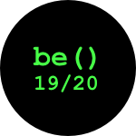
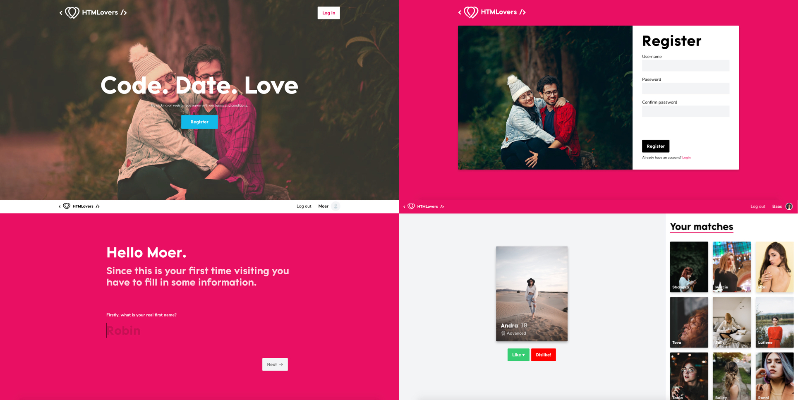

<p align="center">
  
</p>

<h1 align="center">Back-end Course @cmda-bt 19-20</h1>

<p align="center"><b>HTMLovers brings code lovers together, since us programmers need some extra motivation to get out of our chair and adventure the real world, by and with love.</b>
</p>

<br>

<p align="center">
  <a href="https://project-tech.herokuapp.com/">
    
  </a>
  &nbsp;&nbsp;&nbsp;
  <a href="https://choosealicense.com/licenses/gpl-3.0/">
    
  </a>
</p>

<br>



<br>

## Introduction

This dating web app is made as part of a (back-end) course from @cmda-bt 19-20. In this course I had to make a progressively enhanced dating app.

You can find a live version of the dating app here: <a href="https://project-tech.herokuapp.com/">HTMLovers</a>

## Table of Contents

- [Installation](#installation)
- [Application](#application)
  - [Views](#views)
  - [Database](#database)
    - [Setup](#setup)
    - [Table example](#table-example)
  - [Authentication](#authentication)
  - [Validation](#validation)
- [Needs testing](#needs-testing)
- [Known bugs](#known-bugs)
- [Wishlist](#wishlist)
- [Credits](#credits)
- [Sources](#sources)
- [License](#license)

## Installation

Please read the [Attribution-NonCommercial-NoDerivs 3.0 Unported License (“BY-NC-ND 3.0”)](https://creativecommons.org/licenses/by-nc-nd/3.0/) before you download and use this application and/or material.

<details>
  <summary>Show me the installation steps!</summary>

1. Open your terminal

2. Change the directory to a folder in which you want to clone the files

```bash
cd /~path
```

3. Clone the repository (you're going to need [Git](https://www.linode.com/docs/development/version-control/how-to-install-git-on-linux-mac-and-windows/))

```bash
git clone https://github.com/Mennauu/be-course-19-20.git
```

4. Change directory to repository in your terminal

```bash
cd be-course-19-20
```

5. Create a .env file in the root of the repoistory and insert underneath lines. Replace the SESSION_SECRET with a secret of your choice.

```bash
ENVIRONMENT=local

LOCAL_URI=http://localhost:3000/

SESSION_SECRET=Place your own secret here
```

6. Install dependencies from [package.json](https://github.com/Mennauu/browser-technologies-1819/blob/master/package.json)

```bash
npm install
```

7. Run application with [Node](https://nodejs.org/en/) in development mode

```bash
npm run dev
```

</details>

## Application

HTMLovers is a server-side rendered dating web application. You can create an account, setup your information and match with other users based on the given information.

HTMLovers is created using mainly HTML, SCSS, JavaScript, Nunjucks, NodeJS, Express and MongoDB.

### Views

[Nunjucks](https://mozilla.github.io/nunjucks/) is used as a templating engine to render HTML. Nunjucks has been chosen for its easy way of creating macro's, so building component based views is made better, cleaner, easier and above all, more readable. Check out the "notification" component underneath, written as a macro. 

```handlebars


  <div class="c-notification 
         {{ data.class }}" 
        js-hook-notification>

      <p class="notification__message" js-hook-notification-message>

        {{ data.message }}

      </p>

  </div>


```

In our view template we can now easily call the macro by importing it like this at the top of the view file:

```javascript

```

Afterwards, we can call the macro:

```javascript
 {{ notification({ 
   message: 'This is a message', 
   class: 'notification__test' 
 }) }}
```

Now if we don't want to render a class, we can just leave it empty or not mention it at all.

Building macros like this makes them reusable.

### Database

In order to create accounts, save account details and be able to match with other users, we need a **database**. The project is made using JavaScript, NodeJS and Express; [mongoDB](https://www.mongodb.com/) is a perfect database when using these tools, because MongoDB is a document database, which means it stores data in JSON-like documents. [Mongoose](https://mongoosejs.com/) is used as a boilerplate.

#### Setup

_Short disclaimer: passwords are hashed with [bcrypt](https://www.npmjs.com/package/bcrypt)._

<details>
  <summary>Show me the database connection setup and user schema</summary>

#### Database connect
```javascript
class Database {
  constructor() {
    this.connect()
  }

  connect() {
    mongoose.connect(uristring, { useNewUrlParser: true })
  }
}
```

#### Database user schema
```JavaScript
const userSchema = new mongoose.Schema({
  username: String,
  password: String,
  name: String,
  age: Number,
  gender: String,
  attraction: String,
  fromAge: Number,
  toAge: Number,
  level: String,
  avatar: String,
  images: [],
  firstVisit: Boolean,
  liked: [],
  disliked: [],
  matched: [],
})
```
</details>

#### Table example

| _id `objectId` |  images `array` | liked `array` | disliked `array` | matched `array` | username `string` | password `string` | firstVisit `boolean` | age `int` | gender `string` | level `string` | name `string` | avatar `string` | attraction `string` | fromAge `int` | toAge `int` |
|----------------|----------------|---------------|------------------|-----------------|-------------------|-------------------|----------------------|-----------|-----------------|----------------|---------------|-----------------|---------------------|---------------|-------------|
| 5e6e3ecff612c0090673b274 | []               | ['5e6e3ecff612c0090673b274', '5e6e3ecff612c0090673b2cb'] | []               | []              | 'Baas'            | '$2a$10$0BHov9rtizAHGoRHV2gu6.UKmMBzG4hN3GjARcYvZvmyiFqG7bWIK' | False                | 25        | 'Male'          | 'God'          | 'Menno'       | 'assets/uploads/9042463f4413e9761549565dff25b331' | 'Females'           | 18            | 30          |

### Authentication

For authentication and user sessions [Passport](http://www.passportjs.org/) has been used. Passport is an authenticaton middleware. 

Passport is used because it serves one purpose: authentication. It has been fully optimized for authentication through a username and password, which is what we use to authenticate. Passport keeps your code clean and maintainable.

```javascript
passport.use(
  new LocalStrategy((username, password, done) => {
    User.findOne({ username: username }, (err, user) => {
      if (err) return done(err)
      if (!user) return done(null, false, { message: message.incorrectUsername })

      if (!user.validatePassword(password, user.password)) return done(null, false)

      return done(null, user)
    })
  }),
)
```

### Validation

Validation is done on the client, but also over the server. For most validation purposes [validator](https://www.npmjs.com/package/validator) has been used.

When a form is submitted by a user the request is send to server. The server checks if nothing fishy is going on. For instance, when someone tries to register an account, we have to check the username on character length size and if it contains only letters and numbers.

```javascript
// Validate username length
if (!validator.isByteLength(username, { min: 3, max: 20 })) {
  req.flash('error', message.usernameLength)

  return res.redirect('back')
}

// Check if username contains only letters and numbers
  if (!validator.isAlphanumeric(username)) {
    req.flash('error', message.usernameCheck)

    return res.redirect('back')
  }
```

We also perform this check on the client, but the checks can be altered on the client. They can't adjust validation on the server, which is the reason why it's important to always (also) validate requests on the server.

If something is wrong, an error message is returned to the user.

## Needs testing

- [ ] Current: username is case sensitive; do users like it or hate it? Is it a good practice?
- [ ] Current: do users know the difference between username and name?

## Known bugs

- [ ] First input from Settings Form loses autofocus when clicking on the page before the input field is visible (it animates to visible after 5 seconds)
- [ ] No error message if age is under 18
- [x] If a user doesn't have a image (which shouldn't be possible in the first place), the found possible match overlaps with another one
- [ ] Adjusting the default.html doesn't automatically update the rev-default.html (you have to make an adjustment in a SASS or JS file)

## Wishlist

- [ ] Profile page (where you can also adjust information like age ranges and your code level)
- [ ] Chat with matches
- [ ] Add animations for liking and disliking
- [ ] Able to delete your account (add in profile page)

## Credits

**Dept**: I stole their SASS grid and Javascript ModuleInit.

## Sources

Underneath you will find sources that have been used or were helpful for the creation of this application.

- 📖: Documentation or article
- 🛠: Tool or library

> - 🛠 [Express](https://www.npmjs.com/package/express)
> - 🛠 [@express/flash](https://www.npmjs.com/package/express-flash)
> - 🛠 [@express/session](https://www.npmjs.com/package/express-session)

> - 🛠 [Passport](https://www.npmjs.com/package/express)
> - 🛠 [@passport/local](https://www.npmjs.com/package/passport-local)

> - 🛠 [Eslint](https://www.npmjs.com/package/eslint)
> - 🛠 [@eslint/eslint-config-prettier](https://www.npmjs.com/package/eslint-config-prettier)
> - 🛠 [@eslint/eslint-plugin-import](https://www.npmjs.com/package/eslint-plugin-import)
> - 🛠 [@eslint/eslint-plugin-prettier](https://www.npmjs.com/package/eslint-plugin-prettier)
> - 🛠 [@eslint/eslint-plugin-simple-import-sort](https://www.npmjs.com/package/eslint-plugin-simple-import-sort)
> - 🛠 [@eslint/eslint-utils](https://www.npmjs.com/package/eslint-utils)

> - 🛠 [Gulp](https://www.npmjs.com/package/gulp)
> - 🛠 [@gulp/gulp-cli](https://www.npmjs.com/package/gulp-cli)
> - 🛠 [@gulp/gulp-rev](https://www.npmjs.com/package/gulp-rev)
> - 🛠 [@gulp/gulp-rev-delete-original](https://www.npmjs.com/package/gulp-rev-delete-original)
> - 🛠 [@gulp/gulp-rev-replace](https://www.npmjs.com/package/gulp-rev-replace)

> - 🛠 [Rollup](https://www.npmjs.com/package/rollup)
> - 🛠 [@rollup/rollup-plugin-terser](https://www.npmjs.com/package/rollup-plugin-terser)
> - 🛠 [@rollup/rollup-plugin-prettier](https://www.npmjs.com/package/rollup-plugin-prettier)
> - 🛠 [@rollup/plugin-node-resolve](https://www.npmjs.com/package/@rollup/plugin-node-resolve)
> - 🛠 [@rollup/plugin-json](https://www.npmjs.com/package/@rollup/plugin-json)
> - 🛠 [@rollup/plugin-commonjs](https://www.npmjs.com/package/@rollup/plugin-commonjs)
> - 🛠 [@rollup/plugin-alias](https://www.npmjs.com/package/@rollup/plugin-alias)
> - 🛠 [@rollup/rollup-plugin-terser](https://www.npmjs.com/package/rollup-plugin-terser)

> - 🛠 [Babel](https://www.npmjs.com/package/@babel/core)
> - 🛠 [@babel/plugin-transform-runtime](https://www.npmjs.com/package/@babel/plugin-transform-runtime)
> - 🛠 [@babel/preset-env](https://www.npmjs.com/package/@babel/preset-env)
> - 🛠 [@babel/runtime-corejs3](https://www.npmjs.com/package/@babel/runtime-corejs3)
> - 🛠 [@babel/eslint](https://www.npmjs.com/package/babel-eslint)
> - 🛠 [@babel/runtime](https://www.npmjs.com/package/@babel/runtime)

> - 🛠 [TypeScript](https://www.npmjs.com/package/typescript)
> - 🛠 [@typeScript/eslint-parser](https://www.npmjs.com/package/@typescript-eslint/parser)

> - 🛠 [Validator](https://www.npmjs.com/packag/validator)
> - 🛠 [Number & Money formatting](https://www.npmjs.com/package/wnumb)
> - 🛠 [Node SASS](https://www.npmjs.com/packag/node-sass)
> - 🛠 [NO UI Slider](https://www.npmjs.com/package/nouislider)
> - 🛠 [Nunjucks](https://www.npmjs.com/package/nunjucks)
> - 🛠 [Range inclusive](https://www.npmjs.com/package/range-inclusive)
> - 🛠 [Shrink Ray](https://www.npmjs.com/package/shrink-ray-current)
> - 🛠 [ECMAScript module loader](https://www.npmjs.com/package/esm)
> - 🛠 [Is an image](https://www.npmjs.com/package/is-image)
> - 🛠 [Javascript Cookies](https://www.npmjs.com/package/js-cookie)
> - 🛠 [Mongoose](https://www.npmjs.com/package/mongoose)
> - 🛠 [Multer](https://www.npmjs.com/package/multer)
> - 🛠 [bcrypt.js](https://www.npmjs.com/package/bcryptjs)
> - 🛠 [Connect Flash](https://www.npmjs.com/package/connect-flash)
> - 🛠 [Cookieparser](https://www.npmjs.com/package/cookie-parser)
> - 🛠 [Debounce](https://www.npmjs.com/package/debounce)
> - 🛠 [Dotenv](https://www.npmjs.com/package/dotenv)
> - 🛠 [Flexis SRCSET](https://www.npmjs.com/package/@flexis/srcset)
> - 🛠 [Autoprefixer](https://www.npmjs.com/package/autoprefixer)
> - 🛠 [Chokidar CLI](https://www.npmjs.com/package/chokidar-cli)
> - 🛠 [Browsersync](https://www.npmjs.com/package/browser-sync)
> - 🛠 [Connect Browsersync](https://www.npmjs.com/package/connect-browser-sync)
> - 🛠 [Del CLI](https://www.npmjs.com/package/imagemin-cli)
> - 🛠 [Imagemin CLI](https://www.npmjs.com/package/imagemin-cli)
> - 🛠 [Kill port](https://www.npmjs.com/package/kill-port)
> - 🛠 [Make dir cli](https://www.npmjs.com/package/make-dir-cli)
> - 🛠 [NCP - Asynchronous recursive file & directory copying](https://www.npmjs.com/package/ncp)
> - 🛠 [Node sass glob importer](https://www.npmjs.com/package/node-sass-glob-importer)
> - 🛠 [Nodemon](https://www.npmjs.com/package/nodemon)
> - 🛠 [PostCSS CLI](https://www.npmjs.com/package/postcss-cli)
> - 🛠 [Prettier](https://www.npmjs.com/package/prettier)
> - 🛠 [Sass Lint](https://www.npmjs.com/package/sass-lint)
> - 🛠 [Select random file](https://www.npmjs.com/package/select-random-file)
> - 🛠 [SVGO](https://www.npmjs.com/package/svgo)
> - 🛠 [Node random name](https://www.npmjs.com/package/node-random-name)
> - 🛠 [Node zopfli es](https://www.npmjs.com/package/node-zopfli-es)
> - 🛠 [Iltorb](https://www.npmjs.com/package/iltorb)

> - 📖 [MongoDB Documentation](https://docs.mongodb.com/)
> - 📖 [Mozilla developer docs](https://developer.mozilla.org/nl/)
> - 📖 [Nunjucks docs](https://mozilla.github.io/nunjucks/)

## License

<a href="https://choosealicense.com/licenses/gpl-3.0/">
  
</a>
